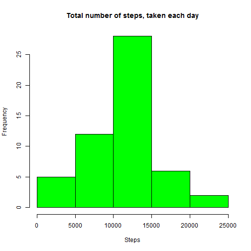
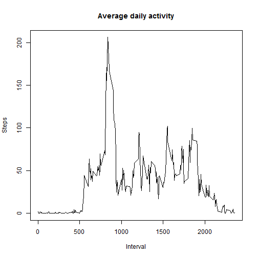
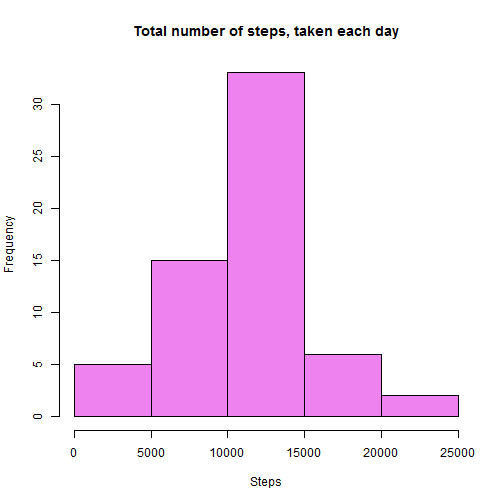
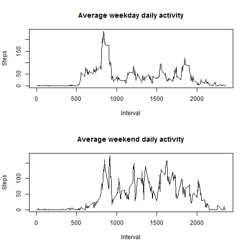

  
## Loading and preprocessing the data

```r
library(data.table)
if (!file.exists("activity.csv")){
    unzip("activity.zip")
}
data <- read.csv("activity.csv", colClasses = c("numeric", "Date", "numeric"))
dt <- data.table(data)
```


## What is mean total number of steps taken per day?


```r
sumSteps <- dt[, list(sum = sum(steps)), by = date]$sum
hist(sumSteps, xlab = "Steps", main = "Total number of steps, taken each day", col = "green")
```

 

The mean and median number of steps taken per day are pretty boring as we don't ignore NA values in this part of report


```r
mean(sumSteps)
```

```
## [1] NA
```

```r
median(sumSteps)
```

```
## [1] NA
```

But we can throw away NA values just out of curiosity.  
First, we can notice that the original data set doesn't contain days with NA values amongst numbers. This follows from the fact that number of steps is always positive number and the following computations: 


```r
notNaSumSteps <- dt[, list(sum = sum(steps[!is.na(steps)])), by = date]$sum
notNaSumSteps[notNaSumSteps != sumSteps]
```

```
## [1] NA NA NA NA NA NA NA NA
```

And therefore mean and median number of steps for recorded days are: 


```r
mean(notNaSumSteps[!is.na(sumSteps)])
```

```
## [1] 10766.19
```

```r
median(notNaSumSteps[!is.na(sumSteps)])
```

```
## [1] 10765
```


## What is the average daily activity pattern?


```r
meanSteps <- dt[, list(mean = mean(steps[!is.na(steps)])), by = interval]$mean
intervals <- levels(factor(dt$interval))
plot(intervals, meanSteps, type = "l", xlab = "Interval", ylab = "Steps", main = "Average daily activity")
```

 

Which 5-minute interval, on average across all the days in the dataset, contains the maximum number of steps?


```r
which.max(meanSteps)
```

```
## [1] 104
```

```r
intervals[which.max(meanSteps)]
```

```
## [1] "835"
```

## Imputing missing values

The total number of missing values in the dataset is
  

```r
dt[, sum(is.na(dt$steps))]
```

```
## [1] 2304
```

We fill the missing values with the mean values for given weekday and interval


```r
weekdays <- sapply(dt$date, weekdays)
newDt <- cbind(dt, weekdays)
meanByWeekdays <- newDt[, list(mean = mean(steps[!is.na(steps)])), by = c("interval", "weekdays")]

fill = function(row){
  if(is.na(row[["steps"]])){
    row[["steps"]] <- meanByWeekdays[interval == as.numeric(row[["interval"]]) & weekdays == row[["weekdays"]]]$mean
  }
  row
}

dt2 <- data.table(t(apply(newDt, 1, fill)))

dt2$steps <- sapply(dt2$steps, as.numeric)
dt2$date <- sapply(dt2$date, as.Date)
dt2$interval <- sapply(dt2$interval, as.numeric)

sumSteps2 <- dt2[, list(sum = sum(steps)), by = date]$sum
hist(sumSteps2, xlab = "Steps", main = "Total number of steps, taken each day", col = "violet")
```

 

Now we can calculate mean and median values of rebuilted data set


```r
mean(sumSteps2)
```

```
## [1] 10821.21
```

```r
median(sumSteps2)
```

```
## [1] 11015
```

These values are slightly larger than those we calculated in the first part of report. Difference between median and mean values in rebuilted data set is greater. 

## Are there differences in activity patterns between weekdays and weekends?


```r
dt2 <- cbind(dt2, wend = ifelse(dt2$weekdays %in% c("Saturday","Sunday"), "Weekend", "Weekday"))
par(mfrow = c(2,1))
meanStepsWeekday <- dt2[wend == "Weekday", list(mean = mean(steps)), by = interval]$mean
meanStepsWeekend <- dt2[wend == "Weekend", list(mean = mean(steps)), by = interval]$mean
plot(intervals, meanStepsWeekday, type = "l", xlab = "Interval", ylab = "Steps", main = "Average weekday daily activity")
plot(intervals, meanStepsWeekend, type = "l", xlab = "Interval", ylab = "Steps", main = "Average weekend daily activity")
```

 
